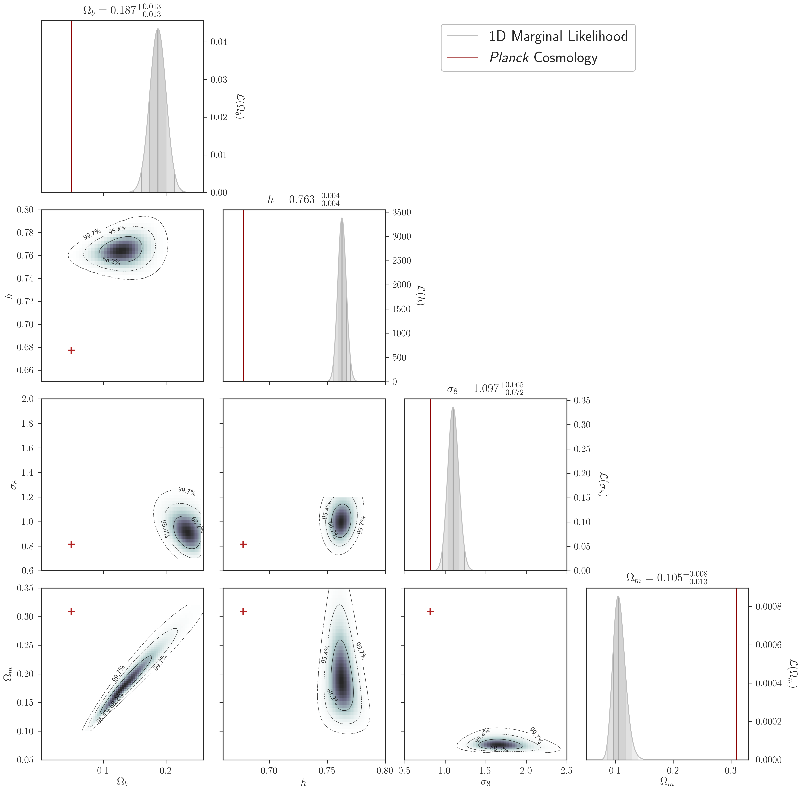
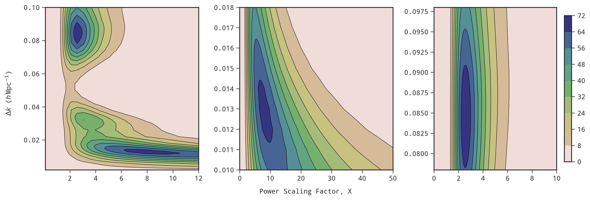
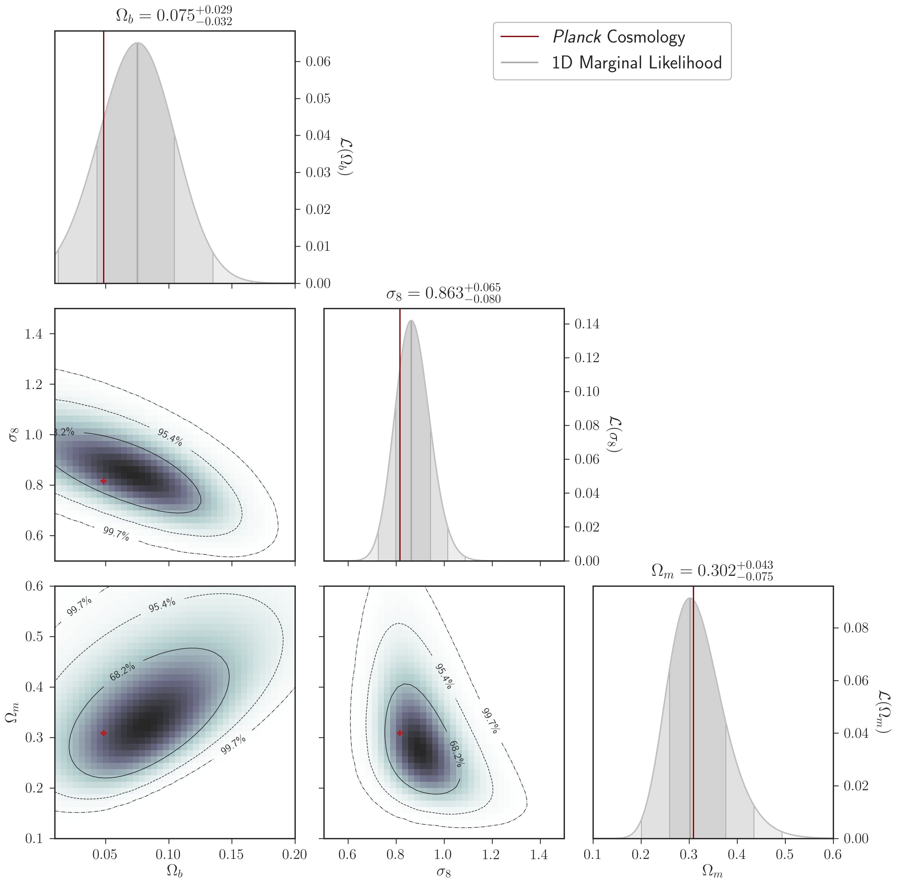
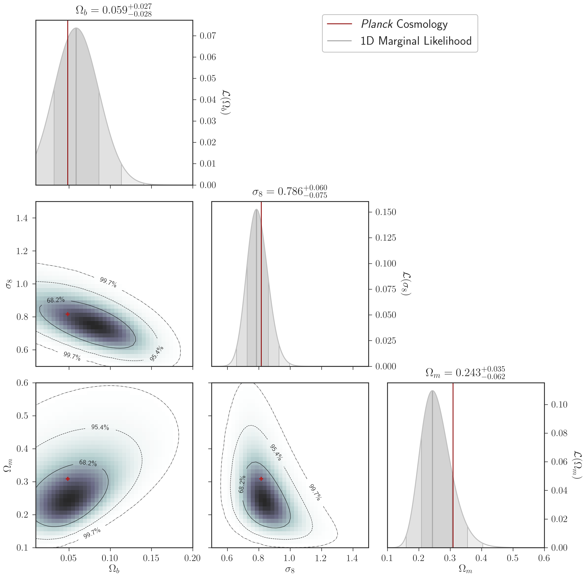

------

eqnos-cleveref: On
eqnos-plus-name: Eq.
...

# Results and Discussion

- In this section we present the results of our power scaling method using the Cosmicflows-3 catalog. We then compare our results to $\Lambda\text{CDM}$ predictions by comparing the power scaled likelihood peaks to the likelihood of the standard model given the velocity data and then by comparing the constraints on $\Omega_m$ and $\sigma_8$ from a marginalized likelihood analysis with and without power scaling the linear power spectrum $P(k)$.

  ## Marginalized Likelihood over $\sigma_*$

- As previously mentioned, we include the 1D non-linear velocity dispersion $\sigma_*$  within the covariance matrix $R_{ij}$ as a parameter to account for small-scale motion in our error measurements. The value of $\sigma_*$ varies between galaxy surveys and is dependent on the underlying sample and the method of measurement and is typically on the order of $\sim 250-350$\si{\km\per\s}. While values for $\sigma_*$ have been constrained for individual surveys, fixing $\sigma_*$ can bias likelihood results towards models that favor the value chosen. Therefore, we leave $\sigma_*$ as a free parameter due to it also acting as an additional noise term that includes unaccounted for systematic errors, which is particularly useful given that the CF3 is a compilation of various surveys. In order to calculate a maximum likelihood estimate independent of $\sigma_*$ we marginalize over the nuisance parameter between $0 < \sigma_* \leq 1000$\si{\km\per\s} using the methods described in Sec#. We quote our measurements from the 1D marginalized maximum likelihood estimate (MLE) of our parameters of interest with our uncertainties from the $1\sigma$ bounds on the likelihood. We fix secondary parameters within our likelihood estimates to the fiducial cosmology provided by the best-fitting values from _Planck_.

- We fit our likelihood method to the CF3 group data and vary the parameterization of the power spectrum and the covariance matrix $R_{ij}$to test the consistency of our data with the $\Lambda\text{CDM}$ model. We find that the inclusion of baryons in the parameterization of the power spectrum in @eq:powerspectrum to strongly influence the amplitude of the power spectrum on both small and large scales. For our methodology we obtain a measurement of $\Omega_b =  0.124_{0.027}^{0.023}$ in $\sim 2.9\sigma$  tension with the expected fiducial _Planck_ value of $\Omega_b = 0.045$. We show the result of our constrain on $\Omega_b$ in Fig #a and we summarize all of our individual 1D maximum likelihood constraints marginalized over $\sigma_*$ in Table #. The inconsistency of our results with _Planck_ cosmology can be best understood by comparing the parameterization of the power spectrum for our measured value of $\Omega_b$ with the _Planck_ value in Fig #b. The larger value of $\Omega_b$ results in a significant increase in the amplitude of the power spectrum for $k\leq 0.1$ (i.e. for scales greater than $\sim 60 h^{-1}$\si{\Mpc}) while also decreasing the the contribution of power to small scales.

  

  

- Within our methodology, the only dependence on $\Omega_b$ is within the parameterization of the shape parameter $\Gamma_\text{eff}$ in the power spectrum. The other two parameters that most strongly influence the shape and amplitude of the power spectrum are $\Omega_m$ and $\sigma_8$, so we chose to compare the constraints on the combination of $\Omega_b$, $\Omega_m$, and $\sigma_8$. In Figure #, we present our constraints on the combinations of these parameters alongside the 1D marginal likelihoods of each parameter from the CF3 group data. Given the linear scales at which we probe, we can see that the uncertainties of the marginalized values are strongly constrained as would be expected. We found that even after marginalizing over $\Omega_m$ and $\sigma_8$ that the CF3 group data still prefers a value of $\Omega_b$ much larger than expected by $\Lambda\text{CDM}$. However, the secondary parameters of $\Omega_m$ and $\sigma_8$ when marginalized over $\Omega_b$ where also inconsistent with the expected values but gave much more reasonable values. This suggests that our measurements are more sensitive to $\Omega_b$ than would be expected and that the value strongly influences both the shape and amplitude of the power spectrum. Thus, we find it reasonable that the individual MLE values listed in Table # are inconsistent with $\Lambda\text{CDM}$ given that the _Planck_ value of $\Omega_b$ is much smaller than the value we have constrained from the CF3 group data. 

- We find it interesting that the CF3 group data favors more power on large scale through a larger value of $\Omega_b$. As before, we can compare our results from the 1D marginal values with _Planck_ cosmology through the parameterization of the power spectrum as seen in Fig #. Again, we find an increase in the amplitude of the power spectrum at large scales for $k \lesssim 0.1$ and a small decrease at small scales for $k > 0.1$. Given the unusually large value of $\Omega_b$ from the CF3 group data we found the additional need for power on large scales to be worth exploring further.

  

  

  ## Power Scaling Method

  - We introduce a scaling factor $X$ into the parameterization of the power spectrum in order to probe adding power on linear scales as given by
    $$
    P(k) \propto k^{n_s} \, T^2(k)
    \begin{cases}
    X  & \text{for } k\leq k_\text{scale} \\[1.25ex]
    1 & \text{for } k > k_\text{scale}
    \end{cases}
    $$
    {#eq:powerscaling}

    where $k_\text{scale}$ is the $k$-value for which we extend the scaling effect over from $k=0$. We demonstrate the power scaling feature on the normalized power spectrum using the fiducial _Planck_ values in Fig #. From @eq:powerscaling, we can see that a power scaling value of $X = 1$ reproduce the standard power spectrum also shown Fig # for comparison. While the power scaling feature is certainly an unnatural parameterization of the power spectrum, we make the assumption that the discontinuous scaling feature becomes trivial once we integrate over the power spectrum in the calculation of the covariance matrix. Thus, the introduction of the power scaling method only serves to add power on the scales we are interested in probing. Therefore, we use the power scaling method as a general probe for excess power on large scales that is not predicted by the standard model. We calculate the likelihood of adding power over a range of $k$-scales as a function of the scaling factor $X$ and compare to the likelihood of the power spectrum using the fiducial _Planck_ cosmology given by a power scaling factor of $X = 1$.

  - We evaluate the 2D joint likelihood between $0.02 \leq X \leq 100​$ and $0.001 \, h \: \text{Mpc}^{-1} \leq k_\text{scale} \leq 0.15 \, h \: \text{Mpc}^{-1}​$ with the results shown in Fig #. Given the computationally expensive calculation of the likelihood, we compute our likelihood over these ranges and interpolate between our result. Two peaks are present within our joint likelihood, the first around $\sim 500 \, h^{-1} \, \text{Mpc}​$ and the second around $\sim 80 \, h^{-1} \, \text{Mpc}​$, both at the large scales we would expect. We find a strong preference towards adding power at these large scales in CF3 group data with the likelihood of the standard model (i.e. $X = 1​$) found to be inconsistent with the $95.4\%​$ confidence interval of the peaks. Given the strong preference of the peaks relative to the standard model, we test if adding power based on the preferred $k_\text{scales}​$ returns cosmological parameters consistent with  $\Lambda \text{CDM}​$ predictions.

  - As before, we evaluate the constraints on the cosmological parameters $\Omega_b$, $\Omega_m$, and $\sigma_8$, in Fig # but with the inclusion of the peak maximum likelihood estimates from the power scaling method in the parameterization of the power spectrum. We find that the 1D marginal likelihood constraints to be generally consistent within $\sim 1 \sigma$ of the fiducial _Planck_ cosmology when the additional power is included, although each peak has a slight preference towards a different cosmology. Interestingly, while the 1D likelihoods using the peak 1 power scaling parameters (at $\sim 500 \, h^{-1} \, \text{Mpc}$) results in a higher than expected $\Omega_b$ value of $\sim 0.075$ with an $\Omega_m$ value highly consistent with the standard model prediction, peak 2 parameters (at $\sim 80 \, h^{-1} \, \text{Mpc}$) returns a highly consistent $\Omega_b$ value with a lower than expected $\Omega_m$ value of $\sim 0.243$.

    

    ​

  - 

## Discussion & Conclusion

- The need for excess large scale power in the CF3 group data is inconsistent with $\Lambda \text{CDM}$ cosmology 

​

​

