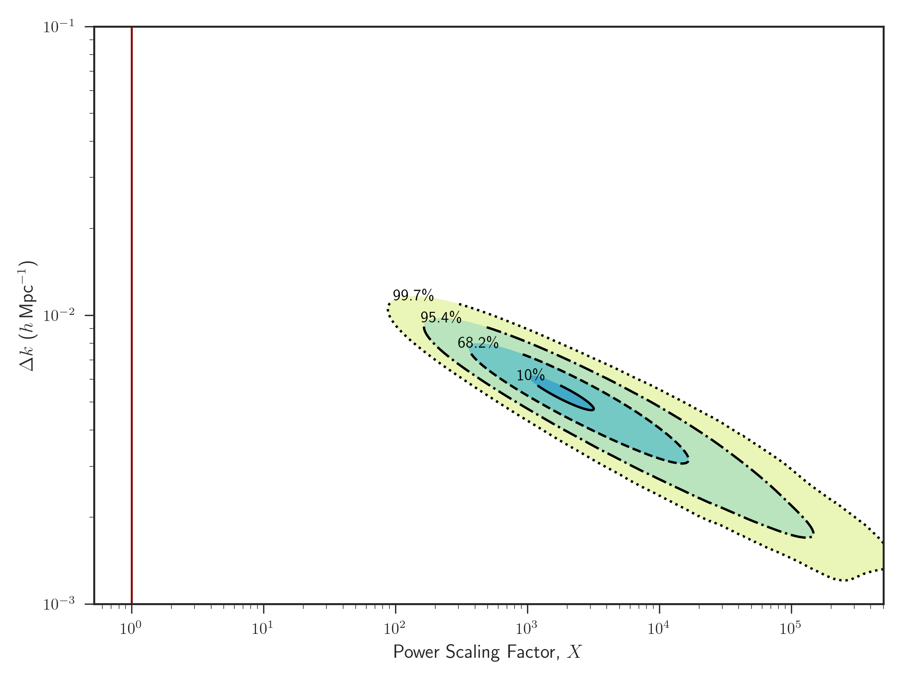

------

eqnos-cleveref: On
eqnos-plus-name: Eq.
...

# Results and Discussion

- In this section we present the results of our power scaling method using the Cosmicflows-3 catalogue. We then compare our results to $\Lambda\text{CDM}$ predictions by comparing the power scaled likelihood peaks to the likelihood of the standard model given the velocity data and then by comparing the constraints on $\Omega_m$ and $\sigma_8$ from a marginalized likelihood analysis with and without power scaling the linear power spectrum $P(k)$.

  ## Marginalized Likelihood over $\sigma_*$

  - As previously mentioned, we include the 1D non-linear velocity dispersion $\sigma_*$  within the covariance matrix $R_{ij}$ as a parameter to account for small-scale motion in our error measurements. The value of $\sigma_*$ varies between galaxy surveys and is dependent on the underlying sample and the method of measurement and is typically on the order of $\sim 250-350$\si{\km\per\s}. While values for $\sigma_*$ have been constrained for individual surveys, fixing $\sigma_*$ can bias likelihood results towards models that favor the value chosen. Therefore, we leave $\sigma_*$ as a free parameter due to it also acting as an additional noise term that includes unaccounted for systematic errors, which is particularly useful given that the CF3 is a compilation of various surveys. In order to calculate a maximum likelihood estimate independent of $\sigma_*$ we marginalize over the nuisance parameter between $0 < \sigma_* \leq 1000$\si{\km\per\s} using the methods described in Sec#. We quote our measurements from the 1D marginalized maximum likelihood estimate (MLE) of our parameters of interest with our uncertainties from the $1\sigma$ bounds on the likelihood. We fix secondary parameters within our likelihood estimates to the fiducial cosmology provided by the best-fitting values from _Planck_.

  - We fit our likelihood method to the CF3 group data and vary the parameterization of the power spectrum and the covariance matrix $R_{ij}$to test the consistency of our data with the $\Lambda\text{CDM}$ model. We find that the inclusion of baryons in the parameterization of the power spectrum in @eq:powerspectrum to strongly influence the amplitude of the power spectrum on both small and large scales. For our methodology we obtain a measurement of $\Omega_b =  0.124_{0.027}^{0.023}$ in $\sim 2.9\sigma$  tension with the expected fiducial _Planck_ value of $\Omega_b = 0.045$. We show the result of our constrain on $\Omega_b$ in Fig #a and we summarize all of our individual 1D maximum likelihood constraints marginalized over $\sigma_*$ in Table #. The inconsistency of our results with _Planck_ cosmology can be best understood by comparing the parameterization of the power spectrum for our value with the _Planck_ value of $\Omega_b$ in Fig #b. The larger value of $\Omega_b$ results in a significant increase in the amplitude of the power spectrum for $k\leq 0.1$ (i.e. for scales greater than $\sim 60 h^{-1}$\si{\Mpc}) while also decreasing the the contribution of power to small scales.

    

    

  - Within our methodology, the only dependence on $\Omega_b$ is within the parameterization of the shape parameter $\Gamma_\text{eff}$ in the power spectrum. The other two parameters that most strongly influence the shape and amplitude of the power spectrum are $\Omega_m$ and $\sigma_8$, so we chose to compare the constraints on the combination of $\Omega_b$ with $\Omega_m$ and then with $\sigma_8$. In Figure #, we present our constraints on the combinations of these parameters where we vary $\Omega_b$ with one parameter while fixing the other. In both cases the 1D marginalized maximum likelihood estimate of $\Omega_b$ marginalized over the second parameter measures a value inconsistent with $\Lambda\text{CDM}$. However, the secondary parameters of $\Omega_m$ and $\sigma_8$ when marginalized over $\Omega_b$ where strongly constrained to within $1\sigma$ of the expected values. This suggests that the individual MLE listed in Table # where we varied a single parameter were strongly influenced by the _Planck_ value of $\Omega_b$ that is much smaller than the values we have constrained. Given that MLE of $\Omega_m$ and $\sigma_8$ marginalized over $\Omega_b$ were consistent with the $\Lambda\text{CDM}$ we find it interesting to that the CF3 group data favors more power on large scale through a larger value of $\Omega_b$ and so we found it worth exploring further.

    

    

  ## Adding power on large-scales

  - We probe adding power on linear scales to mimic the effect of a large $\Omega_b$ value by introducing a scaling factor $X$ into the parameterization of the power spectrum,
    $$
    P(k) \propto k^{n_s} \, T^2(k)
    \begin{cases}
    X  & \text{for } k\leq k_\text{scale} \\[1.25ex]
    1 & \text{for } k > k_\text{scale}
    \end{cases}
    $$
    where $k_\text{scale}$ is the $k$-value for which we extend the scaling effect over as demonstrated in Fig #.

    

  - Two dominant peaks. First at very large scales ~500 h-1 Mpc and second at 80 h-1 Mpc. 

  

  ## MLE of Parameters

  - MLE with and without Power Scaling features. without adding power on large scales that the MLE is very inconsistent with the standard model. When adding the peaks in the power scaling likelihood that both values are consistent with standard model.

  - Including the power scaling peaks in modeling the power spectrum adds power on the scales the data wants but at the cost of reducing the constrains on the parameters.

    ​

    ​

