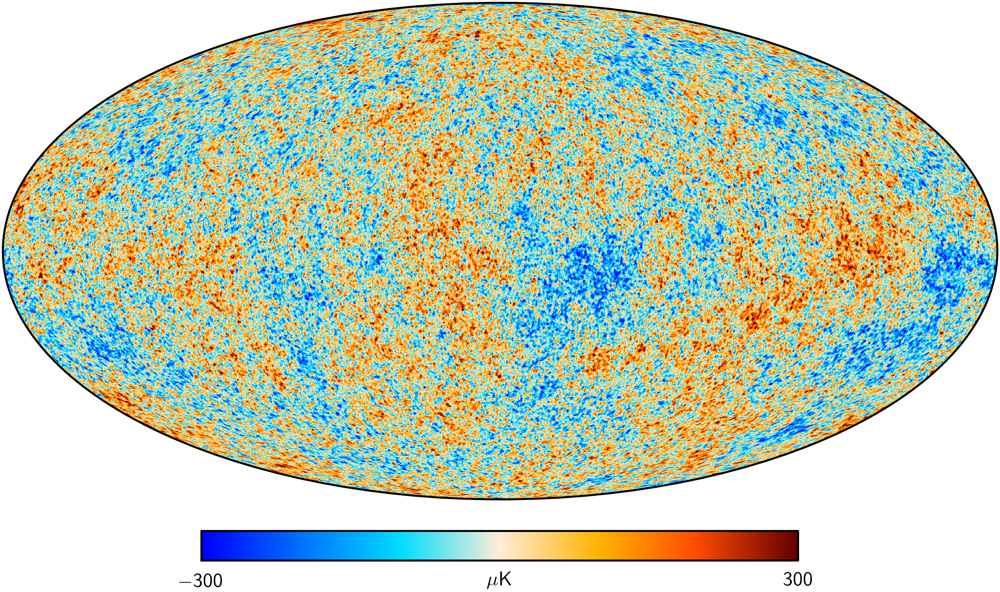
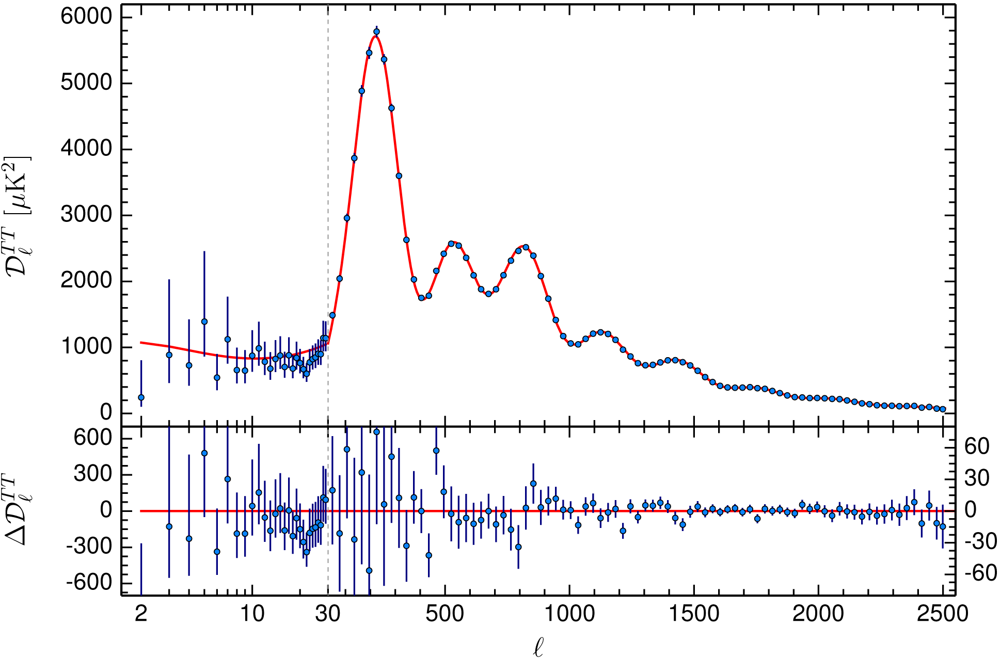

---
eqnos-cleveref: On
eqnos-plus-name: Eq.
...

# A Primer to the Observable Universe

## Doppler Effect

### Classical Doppler Effect

Suppose you are standing on the sidewalk and along the road a parked ambulance turns on its siren. As the ambulance siren blares, it approaches you and you notice that the pitch of the siren seems to have increased such that it sounds higher than it did previously. Then, as the ambulance passes and recedes behind you another change occurs, but now the pitch seems to have decreased such that it sounds much deeper than before. This is a classic example of the phenomenon known as the _Doppler effect_ where a stationary observer experiences a change in frequency due to a moving wave source.  More precisely, the Doppler effect produces an observed shift in the original wave emitted such that an approaching wave source (i.e. the ambulance moving towards the observer) will seemingly appear to have an increase in frequency, meanwhile a receding wave source (i.e. the ambulance moving away from the observer) will appear to have a decrease in frequency. However, it is important to keep in mind that while a shift is observed, in actuality there are no changes to the emitted wave or the wave source itself. The relationship for the _Doppler shifted_ frequency observed is given by the expression:

$$f_\text{obs} = f_\text{em} \left (\frac{v_\text{wave} + v_\text{receiver}}{v_\text{wave} + v_\text{source}}  \right )$$ {#eq:classicdop}

\noindent where $f_\text{obs}$ describes the observed Doppler shifted frequency, $f_\text{em}$ is the emitted frequency by the wave source, $v_\text{wave}$ is  the speed of the emitted wave and is defined by wave velocity equation as the wavelength $\lambda_\text{em}$ times the frequency $f_\text{em}$, $v_\text{receiver}$ is the velocity of the observer receiving the signal (positive when moving towards the source and negative in the opposite direction), $v_\text{source}$ is the velocity of the moving wave source emitting the signal (positive when receding from the observer and negative in the opposite direction)\footnote{As you may have noticed, the relationship results in a constant Doppler shift in the frequency which is not what you would actually observe when an ambulance passes by. The increasing and decreasing in frequency is actually a product of the ambulance passing parallel to the observer which results in a changing angle between the moving wave source and the line of sight between the ambulance and the observer such that $v_{_\text{LOS}} = v_\text{source} \cdot \text{cos}\ \theta$. However, if the ambulance were to drive directly at the observer, they would would hear a constant increase or decrease in the frequency as is the case in our example.}. 

From @eq:classicdop, we can see that for an approaching ambulance for which the observer is at rest: $v_\text{receiver} = 0$, $v_\text{source}$ is negative indicating the ambulance is moving towards the observer, and $v_\text{wave}$ is the speed of sound at approximately \SI{340}{m/s}. Given these conditions, we can write the Doppler effect for sound observed by a stationary observer (as in our ambulance example) as

$$f_\text{obs} = f_\text{em} \left (\frac{1}{1 -v_\text{source} / v_\text{wave}}  \right )$$ {#eq:ambdop}

\noindent where we have simplified the equation in terms of the ratio of the source velocity to the speed of the wave.

### Relativistic Doppler Effect

While the Doppler shifted sound waves experienced by an observer can accurately be described by @eq:classicdop and @eq:ambdop, this form of the equation is only true for wave sources that move much slower than the speed of light. For electromagnetic waves (such as visible light) special relativity dictates that the relationship must be altered such that Lorentz symmetry\footnote{Lorentz symmetry states simply that the laws of physics must uphold in any reference frame.} is upheld. Therefore, the relativistic form of the Doppler effect becomes

$$\nu_\text{obs} = \nu_{em}\ \sqrt{\frac{1- \beta}{1 + \beta}}$$ {#eq:reldop}

\noindent where $\nu$ is the relativistic notation for frequency (equivalent to $f$ in the classical case) and the dimensionless $\beta = v/c$ is ratio between the relative velocity $v = v_\text{source} - v_\text{rec}$ to the speed of light $c$. Note that $\beta$ is positive when the observer and the source are receding away from each other and negative when the observer and the source are approaching each other---analogous to $v_\text{source}$ in the classical case. The relativistic Doppler effect may seem quite different from our classical case in @eq:classicdop; however, if we Taylor expand about the low-velocity limit (for $v \ll c$) where the relative velocity is much slower than the speed of light we find that $\nu_\text{obs} = \nu_\text{em} \left( 1 - \beta +  \mathcal{O}(\beta^2) \right)$. Using the same low-velocity analysis on @eq:classicdop, we find that $f_\text{obs} = f_\text{em} \left( 1 - \beta \right)$ such that the relativistic Doppler effect reduces to the classical case for relative velocities much less than the speed of light.

### Redshift

The Doppler effect is particularly useful in astronomy because each element has a unique spectrum of emission and absorption lines that will appear Doppler shifted by a moving astronomical source. Astronomers may draw useful information from Doppler shifts in spectroscopic measurements, such as the distance, velocity, and composition of an astronomical object. This is accomplished by comparing the position of the spectral lines of a specified element against their rest frame wavelength. We will find it useful to define the relativistic Doppler shift in terms of the redshift $z$ of the initial signal as

$$z \equiv \frac{ \lambda_\text{obs}}{\lambda_\text{em}} - 1 =  \frac{\Delta\lambda}{\lambda_\text{em}} = \sqrt{\frac{1 + \beta}{1-\beta}} - 1$$ {#eq:redshift}

\noindent where we have used the wave velocity relation to rewrite the Doppler shift in @eq:reldop in terms of wavelength. The term redshift is used because it implies that the signal's wavelength has been lengthened, synonymous to longer wavelengths in the visible spectrum corresponds to red light. Likewise, a negative redshift is equivalent to a blueshift, a shortening of the signal's wavelength. From the limiting case for the low-velocity regime where $v \ll c$, using our previous result in @eq:redshift we find that

$$z \simeq \frac{v}{c}$$ {#eq:lowvelocity}

\noindent where receding sources appear redshifted and approaching sources appear blueshifted relative to an observer.

## Standard Candles

A Standard candle is a class of astronomical objects that possess an intrinsic quality shared amongst the class, a 'standard' so to speak, that provides a well known luminosity. Examples of standard candles include Cepheid variable stars, planetary nebula, Tully-Fisher relation for spiral galaxies, and supernovae amongst others. All of these contribute to the cosmic distance ladder, a chain of various techniques used to measure different length scales. 

### Parallax

The foundation of the distance ladder is the geometric effect of measuring nearby astronomical objects called parallax. The parallax uses the apparent displacement of a distant object as the observer changes their position to measure the distance and is described by $d = 1 / p$ (for $p \ll 1\, \text{radian}$), where $d$ is the distance in parsecs (\SI{1}{\parsec} $\simeq$ \SI{3.26}{\lightyear}) and $p$ is the parallax angle in arcseconds. While this method provides some of the most accurate distance measurements, it is limited by the apparent displacement which for large distances becomes difficult to resolve\footnote{Parallax measurements from ground-based telescopes are able to resolve to distances of about \SIrange{50}{100}{\parsec}, while space-based telescopes are able to extend this limitation to \SIrange{200}{300}{\parsec} within 10% accuracy.}.

### Cepheid Variable Stars & The Magnitude System

Despite the limitations of the parallax, the accuracy of the method allows astronomers to calibrate standard candles that can measure distances at much greater length scales on the cosmic distance ladder. The most well-known standard candles are Cepheid variable stars: stars characterized by a period of pulsation---a defined period of contraction and expansion---during which a change in brightness is observed\footnote{It should be noted that when we mention brightness we are explicitly referring to the flux of light we measure in \si{\watt\per\metre\squared}.}. As Cepheids change in physical size, the absolute brightness or _luminosity_ $L$ also changes resulting in a change in apparent brightness $B$ on Earth as defined by the inverse square law for light:

$$B= \frac{L}{4 \pi \cdot d^2}$$ {#eq:invsqrlaw}

\noindent where $d$ is the distance. Given @eq:invsqrlaw, distance measurements would normally be a challenge to calculate due to needing to know the luminosity _a priori_. What makes Cepheid variables an important standard candle is that from empirical evidence we know that there is a direct relationship between the period of pulsation and the true luminosity known as the _period--luminosity relationship_. Thus, by measuring the period of pulsation from changes in apparent brightness we are able to infer the luminosity from the relation and thus measure distance to Cepheids in galaxies far greater than the reach of parallax measurements. The accuracy of the period--luminosity relationship is dependent, however, on standard luminosity measurement to nearby Cepheids in which the parallax distance can be used to calibrate the method. For example, in 2002 the Hubble Space Telescope in partnership with the Hipparchus Satellite was able to use the parallax method to determine the most accurate distance measurement to the closest known Cepheid variable star, Delta Cephei, thus establishing a cosmic benchmark on the ladder for other distance methods. The period--luminosity relationship is often regarded as the stepping stone by which other methods are compared against to improve the accuracy of our distance measurements.

A more common astronomical method of measuring distance analogous to the inverse square law of light in @eq:invsqrlaw involves the magnitude system, a logarithmic magnitude scale of a stellar object's brightness\footnote{invented by the Greek astronomer Hipparchus and Ptolemy. Eye sees logarithmically. Makes sense!}. Due to the logarithmic nature, the system is fairly counterintuitive such that an object brightness are given in 'reverse order' whereby brighter objects have a negative magnitude while dimmer objects have a positive magnitude. We define the apparent magnitude $m$ (as seen from Earth) as

$$m \equiv m_a - m_b = -2.5 \log_{10} \left( \frac{B_a}{B_b} \right)$$ {#eq:mag}

\noindent where $m_a$ is the magnitude of  object of interest and $m_b$ is of a comparison object and $B_a$ and $B_b$ correspond to their respective apparent brightness as defined in @eq:invsqrlaw.

From @eq:mag it is clear that a change of 1 magnitude corresponds to a 2.5 decrease in brightness between the objects. In order to standardize the relative comparison of magnitudes we define $m_b$ to be the apparent brightness of the star Vega such that objects that are brighter have a negative magnitude and objects that are dimmer have a positive magnitude\footnote{By this standard, it would naturally follow that Vega has a reference magnitude of 0}. We can measure the luminosity of an object in the magnitude system through the absolute magnitude $M$ by expressing @eq:mag in terms of the inverse square law such that

$$M = m - 2.5 \log_{10} \left[ \left( \frac{d}{10\, \text{pc}} \right)^2 \right] $$ {#eq:absmag} 

\noindent where $m$ is the apparent magnitude and $d$ is the distance in parsecs\footnote{The convention assumed here is to measure the absolute magnitude of an astronomical object at a standard astronomical distance of 10\si{\parsec}}. Finally, we can express @eq:absmag in terms of the distance modulus $\mu = m - M$, the difference between the apparent magnitude $m$ and the absolute magnitude $M$, such that

$$\mu \equiv m - M = -5 + 5  \log_{10} (d) + K.$$ {#eq:distmod}

\noindent where the $K$ correction term is non-zero if $d\gg$\SI{10}{\parsec} due to extinction by gas and dust.

### Tully-Fisher Relationship & Fundamental Plane

Building off the stepping stone of the Cepheid' period--luminosity relationship, we can use the Tully-Fisher relation and Fundamental plane to extend the distance ladder to scales on the order of 1\si{\Gigaparsec}---the length scales of galaxy clusters. 

The Tully-Fisher relation is an empirically driven relationship between the rotational velocity of a galaxy and its absolute magnitude. In the context of the distance ladder it forms one of the most important distance estimators due to its measurement of the 21-centimeter hydrogen line, a far infrared line in the microwave spectrum, which is relatively unperturbed by objects that normally are opaque to shorter wavelengths\footnote{This technique is especially important to physical cosmology for its accurate prediction of the ratio of luminous matter in the galaxy disk to the dark matter halo that surrounds it. For further reading refer to Desmond et al., 2015 on the Tully-Fisher Relation and mass-size relations to halo abundance. https://arxiv.org/abs/1506.00169}. Given the 21-centimeter hydrogen line, we can measure the redshift and blueshift due to the rotation of a galaxy and estimate the rotational velocity of the galaxy.

However, given that we need distance estimates to measure the luminosity in terms of the absolute magnitude, again we can see the distance ladder in effect in that we use Cepheid distance measurements from both parallax and period-luminosity relationship within individual galaxies to calibrate the distance to the galaxy themselves. Subsequently, we can plot the rotational velocity and the absolute magnitude of individually calibrated galaxies to show the Tully-Fisher relation. Thus, given a rotational velocity from far redshift objects we can not only estimate the absolute magnitude, but more importantly a distance estimate that otherwise wouldn't be possible.

As we have seen, these techniques often overlap in the length scales they measure which is important for the calibration of the ladder through overlapping distance measurement within individual galaxies allowing allowing for multiple classes of distance estimators. Moreover, from @eq:invsqrlaw equation, we can see that the accuracy of our distance estimates depends on how well we estimate the object's true luminosity. Thus, determining the most suitable and accurate standard candles is the trickiest aspect of distance measurements as each method introduces some form of uncertainty. Regardless of the challenges in the method, distance measurements are one of the only methods that allow us to probe the cosmos and test our theories of the Universe. From this perspective, we see that distance measurement truly provide the foundation for understanding the structure and evolution of the universe---the _cosmology_ of our universe.

## Hubble's Law

In the late 1920s using distance and spectroscopic redshift measurements of Cepheid variables, Edwin Hubble found that a galaxy's relative velocity away from Earth is proportional to the distance between us. The relationship now known as Hubble's law can be expressed as 

$$v \simeq cz = H_0 d$$ {#eq:Hubble}

\noindent where we have expressed the relative velocity $v$ (in \si{km/s}) in terms of the low-velocity limit from @eq:lowvelocity, $H_0$ is the proportionality constant between the relative velocity and the distance to the object in \si{\km\per\s\per\Mpc}, and $d$ is the distance in megaparsecs (\SI{1}{\Mpc} $=$ \SI{e6}{\parsec} $\equiv$ \SI{3.26}{\Mega\lightyear}). 

While the redshift observed on Earth is often interpreted as a Doppler shift due to the method of measurement, this leads to a troubling interpretation of the Universe. That being that if the relative velocity is due to a Doppler redshift, than this would imply that everything in the night sky is receding away from us and that the Earth is located in a privileged place in the Universe. However, as Hubble amongst others had noticed, this statement is in obvious conflict with the Copernican principle which states that humans are not privileged observers of the Cosmos---i.e. that we are not located anywhere special with regards to the Universe around us. Another possible interpretation that does not require sacrificing the Copernican principle had been proposed independently as part of a solution of Einstein's field equations of general relativity by the Soviet mathematician Alexander Friedmann and the French astronomer Georges Lamaitre: that we reside in an expanding universe and Hubble's law provided the first empirical evidence supporting this theory. Under this interpretation, the relative velocity is not a result of intrinsic motion of galaxies away from us, but rather the result of the space between us stretching. The solution of Einstein's field equations supported by Hubble's discovery is known as Friedmann-Lemaitre-Robertson-Walker (FLRW) metric from which the standard model of modern cosmology was born.

Moreover, the most recent measurements of Hubble's law from Type Ia Supernovae not only imply that the Universe is expanding, but that it is doing so at an accelerating rate. The Hubble constant is currently measured in the range of \SI{67-75}{\km\per\s\per\Mpc}\footnote{Add footnote on discrepancies between Planck Satellite and Supernovae Type Ia measurements}, meaning that every megaparsec of space is being stretched at a rate of approximately \SI{70}{\km\per\s} . If we assume the total matter in the Universe is conserved, then by running the linear expansion proposed by Hubble's law in reverse we are led to the interesting conclusion that the Universe we observe today is far less dense than in the past. In fact, the inverse Hubble constant\footnote{Hubble's constant can be written in terms of inverse time such that $H_0 \approx$\SI{70}{\km\per\s\per\Mpc}=\SI{2.27e-18}{\per\s}} represents the Hubble time $t_H = H_0^{-1}\approx$\SI{14}{\G\yr} when all the matter in the Universe that is currently observed today coincided in an infinitely dense primordial state prior to the onset of cosmological expansion. We know now that the history of the Universe is far more complicated than the picture given by the linear Hubble's law, but the general interpretations are valid: the primordial Universe existed in an infinitely dense state when at $t_H \approx t_0 =$ \SI{13.8}{\G\yr} the Universe began expanding in an event known as the _Big Bang_.

### Cosmic Microwave Background

- Hot Big Bang Cosmology
  - The Big Bang theory provides the best framework for the very early Universe as we understand today from which we can model the formation and evolution of the Universe through time. After the initial Big Bang, the early Universe existed in a hot, infinitely dense state from which the temperature extreme inhibited the stable combination of free particles into even neutral hydrogen atoms. Instead, for approximately \SI{380,000}{\y}, the free charged particles interacted strongly with photons resulting in an opaque plasma from which no light escaped. However, during this time the Universe continued to expand and cool until the time of recombination (at a temperature of about \SI{3000}{\K}) when neutral hydrogen atoms could stably form resulting in a transparent hydrogen gas. With a lower temperature and fewer charged particles to interact with, photons decoupled from ionized atoms were no longer scattered off electrons and were able to escape the gas and free-stream the forming Universe undisturbed. The remnants of the time of last scatter are observed today as the cosmic microwave background (CMB), microwave photons emitted uniformly across the night sky in all directions.

- Universe is Isotropic:
  - After correcting for local motion due to our solar system and galaxy, the microwave photons were found to maintain a blackbody spectrum characterized by a temperature of \SI{$2.726$ ($\pm 0.0013$)}{\K} (from \SI{3000}{K} as a result of high-redshifting due to cosmological expansion) with fluctuations on the order of milliKelvin. The minute fluctuations relative to the characteristic temperature of the primordial plasma lends reason to the density of the early Universe (at the time of recombination) being extremely isotropic. Isotropy implies that if matter is conserved then density measurements of the known Universe would show a uniform matter density regardless of angle of observation. Indeed, by analyzing the density of the CMB and comparing with known neutral hydrogen and helium density from nucleosynthesis measurements today we are able to confirm that matter is conserved strongly suggesting isotropy.

- Universe is Homogenous
  - While the Universe is isotropic, there are no conditions in the CMB that directly imply that the Universe must be homogeneous. A homogeneous Universe would imply that observations of the Universe would appear the same independent of location. While cosmological expansion and the Copernican principle allowed us to deduce that it is very unlikely that we are located at the center of the Universe, the conclusion still must be verified independently. Recently, various large-scale surveys, such as the 2dF galaxy survey, have been undertaken to map galaxy distributions via redshift measurements. Figure ## shows galaxy distribution data from the 2dF galaxy survey which can provide insight into the homogeneity of the Universe. At local distances of redshift $z \lesssim 0.05$, if we were to closely analyze the galaxy distributions we would see variations in structure that seem to diverge from an isotropic image of the Universe. However, at larger distances of $z \approx 0.15$ we see that the distribution of galaxies become very homogeneous with very little distinction between positions in redshift space. Thus, on the largest scales we find that the Universe is both isotropic and homogeneous otherwise known as the _Cosmological Principle_.

  

  

- Recipe for the Cosmos

  - While the CMB provides us with a strong argument for a homogeneous and isotropic Universe, arguably the most important cosmological information comes in the form of the tiny milliKelvin anisotropies from recent measurements by the Planck Satellite, shown in Figure #. We can decompose Figure # by the magnitude of the temperature fluctuations $\mathcal{D}^{T}$ as a function of the multipole moment $l$, where the angular scale or "wavelength" of the fluctuations $\lambda = \frac{2\pi}{l}$ is determined by the number of modes $l$ within a given angle on the night sky. To understand the relative contribution of each mode $l$ to the fluctuations seen in the CMB we must quantify the amplitude of the fluctuations on a given scale known as the _power spectrum_. More generally, the power spectrum describes the power $\mathcal{P}$ on a given scale $n$ through the square of the Fourier amplitude $a_n$ such that $\mathcal{P}(n) \propto  |a_n|^2 = C_n$. The angular power spectrum $\mathcal{D_l^{TT}}$ of the CMB is described as

  - $$
    \mathcal{D}_l^{TT} \equiv |\mathcal{D}^{T}|^2 \; l(l+1) / 2\pi = C_l \; l(l+1) / 2\pi
    $$

    where $l(l +1)/2\pi$ accounts for the 2D field of view of the night sky. Figure # shows the resulting CMB angular power spectrum as a function of the multipole moment $l$ with the best fit line given by the $\Lambda\text{CDM}$ model, the standard cosmological model based on the FLRW metric. 

  - We can define a density parameter $\Omega$ which describes ratio of the observed density $\rho$ of any form of relativistic or non-relativistic matter and energy in the Universe to the critical density $\rho_c$. The critical density is a predicted value given by the FLRW metric which determines the spatial geometry and fate of our Universe. As seen in Figure #, the CMB angular power spectrum places strong constraints on the parameters that describe the $\Lambda\text{CDM}$ model giving us a value for the total mass-energy density of $\Omega_0 \simeq  1$\footnote{For those who are curious, $\Omega_0 = 1$ implies a Universe with flat spatial geometry. And, while highly fascinating, the mathematics and physics describing the geometry and fate of the Universe is unfortunately beyond the scope of this thesis. For further inquiry please refer to any intermediate or advance graduate level cosmology text.}, where we use the subscript $0$ to indicate the value at present time. Given that the total mass-energy density $\Omega_0$ is essentially at unity with the critical density, we can list the ingredients that form our Universe in terms of their fractional density contribution as calculated from the best fit $\Lambda\text{CDM}$ model of cosmology.

  - Ordinary Matter

    - Ordinary matter, also known as visible matter, is any form of matter that interacts with and emits electromagnetic radiation and is primarily found within galaxies.  The visible Universe is almost entirely composed of baryonic matter (i.e. protons and neutrons) and electrons. The current value for the baryonic density parameter $\Omega_b$ is $0.0486 \pm 0.0010$ or about $4.86\%$ of the total density of the Universe. Given the principle of conservation of charge, we would expect that the number density of electrons to be about that of baryons. However, baryons by nature are far more massive than electrons and thus we find the mass-energy density contribution of electrons to be negligible given the small contribution of baryonic matter to the total density.

  - Relativistic Particles

    - The most common relativistic particles that compose our Universe are that of electromagnetic radiation and neutrinos. In our Universe today, the majority of radiation is in the form of the uniform photon gas observed in the CMB with very little contribution from visible light from stars and other sources. The radiation density $\Omega_\gamma$ as measured today provides a negligible contribution on the order of $8 \cdot 10^{-5}$ or approximately $0.002\%$ of the total mass-energy in the Universe.

  - Dark Matter

    - Up to this point, the density of all the matter and particles we are comfortably familiar contributes less than $5\%$ to the total mass-energy density in the known Universe. For decades cosmologist have grappled with the idea that there may be more matter in the Universe than what we can observe. This unknown form of matter has been observed\footnote{through observations } to be gravitationally bound but lacking any known form of interaction with electromagnetic radiation thus appearing 'dark' compared to ordinary matter. While we know very little about this invisible dark matter, the best fitting $\Lambda\text{CDM}$ model provides us with a density contribution of dark matter $\Omega_c$ of $0.2589 \pm 0.00574$ meaning that it composes roughly $26\%$ of the known Universe. The model also suggests that it is probably composed of an undiscovered particle that is both massive and non-relativistic leading to the term _cold dark matter_ or CDM in the $\Lambda\text{CDM}$ model. We can define the total matter density parameter $\Omega_m$ as the sum of the ordinary and dark matter such that $$\Omega_m = \Omega_b + \Omega_c = 0.3089 \pm 0.0062$$ as observed in today's Universe.  

  - Dark Energy

    - The total matter density $\Omega_m$ contributes only ~$31\%$ to the total mass-energy density leaving a sizable gap in the density makeup of the Universe thus requiring some form of _dark energy_ to describe the missing energy density. It turns out that the discovery of the accelerating expansion of the Universe as observed by the most recent measurements of Hubble's law could be the key to this problem. Einstein's field equations predict that in the absence of anything to counteract the effects of gravitational attraction, the expansion of the Universe would be slowing slow down. For this reason, Einstein included an independent parameter known as the cosmological constant $\Lambda$ to his equation to counteract the effects of gravity and force a static Universe without changing the overall physics of the equation. However, early observations clearly indicated an expanding Universe so for decades the term was abandoned---that is until the recent Type Ia Supernovae observations improved our measurement of the expansion rate. It turns out that the addition of a cosmological constant $\Lambda$ is functionally equivalent to the existence of a uniform, non-zero vacuum energy density $\rho_\text{vac}$ permeating empty space. Under this assumption, the effective vacuum energy density due to the cosmological constant could theoretically allow for the expansion of the Universe to be accelerating providing the best explanation for dark energy. Given the hypothetical nature of the cosmological constant very little is understood about this so-called dark energy; however, given the total matter density, the fractional density contribution of dark energy $\Omega_\Lambda$ is measured to be $0.6911 \pm 0.0062$ such that $\Omega_0 = \Omega_\text{m} + \Omega_\Lambda = 1$. 
